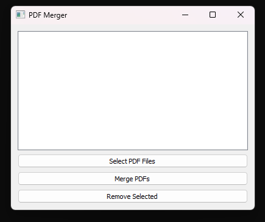

### Description
- Python application that combines multiple PDFs, providing an interface

### Program Sample

### Usage

'''sh
Locate main.py file
'''

'''sh
Double-click main.py file
'''

### Requirements 
- PyQt5   (library for interface widgets)
- PyPDF2  (library for pdf file merging)

### Optional for easier use
- Create shortcut to launch 'main.py' from the project folder

### side note. 
- open/run through python interpreter, not through virtual env like wsl.